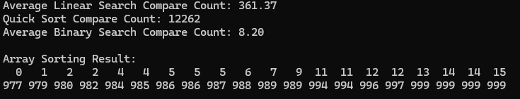
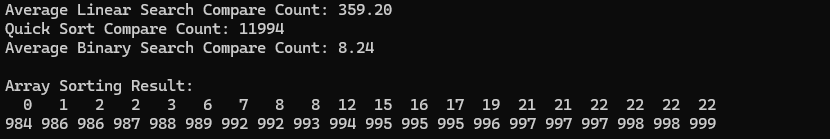

퀵 정렬후의 이진탐색에서 순차탐색보다 적게 비교하는 이유는 
기본적으로 100번의 탐색을하는데 
100번을 하면서의 순차탐색의 평균적인 시간복잡도는 3/4xn번이다
100으로 계산한다면 75번의 비교를한다
하지만 이진탐색에서는 log n의 비교를 하는데 이는 퀵소트로 정렬을 한 상태이기 때문이다
전체적으로 퀵소트의 평균값인 13000번을 더한다고 생각했을때는 
확실히 비교를 후자가 많이 하기는 한다 
하지만 이 임의의 숫자가 엄청나게 큰 10의9승에 달하는 배열에 크기에서 찾는다면
후자의 비교의 횟수가 유의미해진다 일정수준까지는 퀵정렬과 이진탐색의 비교가 
더크지만 숫자가 커질수록
퀵 정렬후의 이진탐색에서 순차탐색보다 적게 비교하는 이유는 
기본적으로 100번의 탐색을하는데 
100번을 하면서의 순차탐색의 평균적인 시간복잡도는 3/4xn번이다
100으로 계산한다면 75번의 비교를한다
하지만 이진탐색에서는 log n의 비교를 하는데 이는 퀵소트로 정렬을 한 상태이기 때문이다
전체적으로 퀵소트의 평균값인 13000번을 더한다고 생각했을때는 
확실히 비교를 후자가 많이 하기는 한다 
하지만 이 임의의 숫자가 엄청나게 큰 10의9승에 달하는 배열에 크기에서 찾는다면
후자의 비교의 횟수가 유의미해진다 일정수준까지는 퀵정렬과 이진탐색의 비교가 
더크지만 숫자가 커질수록 퀵소트 + 이진 탐색이 순차 탐색보다 훨씬 더 효율적이다 

