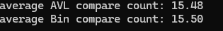
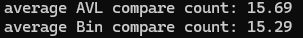
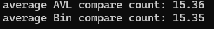

이진탐색트리의 최악의 경우는 항상큰값이나오거나 항상 작은값으로 나오면 트리는 선처럼 한쪽으로 계속 치우쳐지게 된다
이때의 시간복잡도는 O n 이다 
하지만 avl트리는 이러한 점을 고치기 위해서 만들어진 트리이고 그렇기에 최악의 경우에도 log n의 비교로 삽입과 삭제가 가능하다
구현난인도는 이진탐색트리가 좋다고 생각이 되지만 최악의경우에도 log n 의 비교를 하는 avl트리가 성능적으로 좋다고 생각된다 
